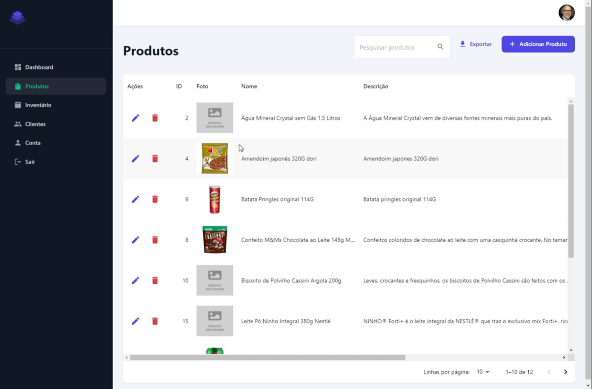
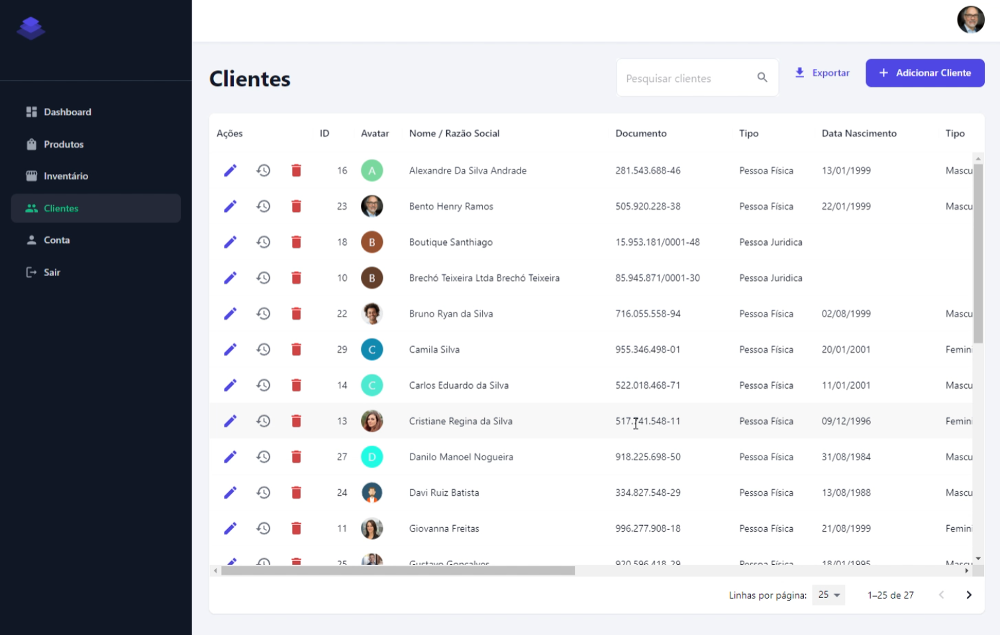
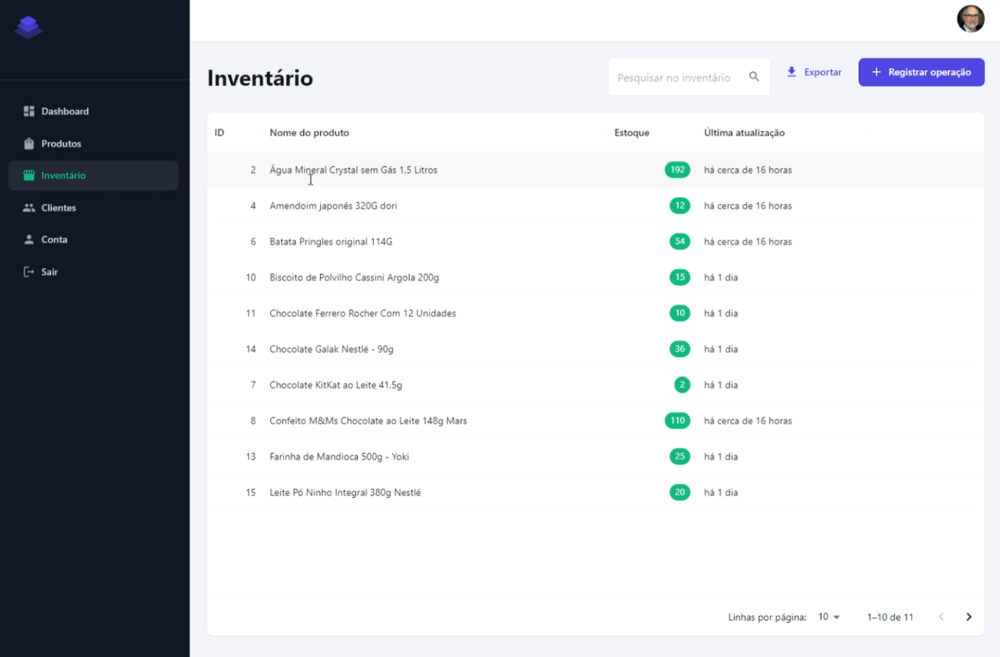
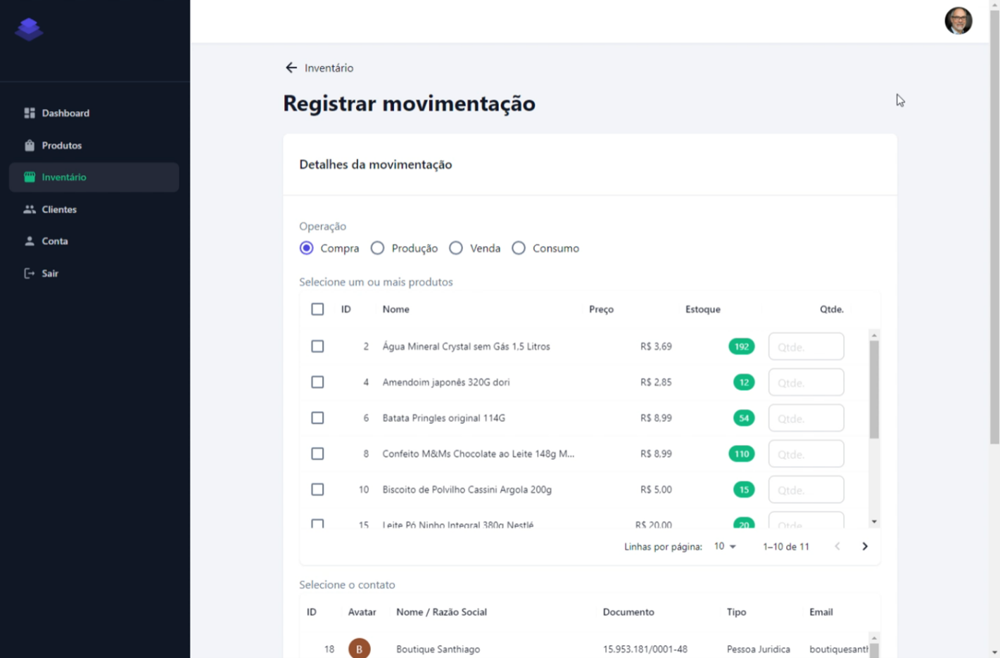
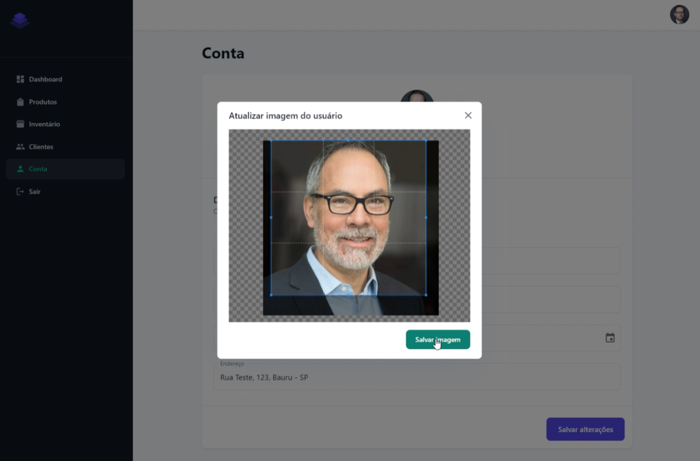

<div align="center">
    <h2>Projeto de Computação - Sistema Web de Controle de Estoque </h2>
</div>
<div align="center">

[**Sobre**](#-sobre) &nbsp;&nbsp;**|**&nbsp;&nbsp;
[**Tecnologias e ferramentas utilizadas**](#-tecnologias-e-ferramentas-utilizadas) &nbsp;&nbsp;**|**&nbsp;&nbsp;
[**Capturas de telas**](#-capturas-de-telas) &nbsp;&nbsp;**|**&nbsp;&nbsp;
[**Instalação e execução**](#-instalação-e-execução) &nbsp;&nbsp;**|**&nbsp;&nbsp;
[**Como contribuir**](#-como-contribuir) &nbsp;&nbsp;**|**&nbsp;&nbsp;
[**Desenvolvedores**](#-contato)

</div>

## 📃 Sobre


**FrontCommerce** é o projeto de computação (TCC) desenvolvido ao final do curso de Ciência da Computação no UNISAGRADO.

O projeto consiste em uma aplicação web voltada ao controle de estoque de empresas de pequeno/médio porte.

Ao todo, temos 5 páginas listadas no menu principal, sendo:
- **Dashboard** – página que possui uma visão geral do sistema com a lista de movimentações de todos os clientes, podendo filtrar pelos 4 tipos de operações: Compra, Venda, Produção e Consumo;
- **Produtos** – página com a lista de produtos cadastrados no sistema, exibindo suas imagens, descrições, preços e unidades de medidas;
- **Inventário** – listagem do estoque da empresa, com a quantidade dos produtos;
- **Clientes** – listagem dos clientes cadastrados (pessoas físicas e jurídicas);
- **Conta** – página de perfil do usuário logado com campos para alterar as informações pessoais e atualizar a foto de perfil.

## 🚀 Tecnologias e ferramentas utilizadas

<table>
  <tbody>
    <tr>
      <td style="font-weight: bold">Back-end</td>
      <td>
        <a href="https://dotnet.microsoft.com/en-us/" target="_blank" rel="noopener noreferrer">.NET</a>,
        <a href="https://learn.microsoft.com/en-us/dotnet/csharp/" target="_blank" rel="noopener noreferrer">C#</a>,
        <a href="https://www.mysql.com/" target="_blank" rel="noopener noreferrer">MySQL</a>
      </td>
    </tr>
    <tr>
      <td style="font-weight: bold">Front-end</td>
      <td>
        <a href="https://reactjs.org/" target="_blank" rel="noopener noreferrer">React</a>,
        <a href="https://www.typescriptlang.org/" target="_blank" rel="noopener noreferrer">TypeScript</a>,
        <a href="https://nextjs.org/" target="_blank" rel="noopener noreferrer">NextJS</a>,
        <a href="https://mui.com/" target="_blank" rel="noopener noreferrer">MUI</a>,
        <a href="https://axios-http.com/docs/intro" target="_blank" rel="noopener noreferrer">Axios</a>
      </td>
    </tr>
  </tbody>
</table>

## 🖥️ Capturas de telas

<figure>
  <div align="center">
    
    <figcaption>Página de produtos</figcaption>
  </div>
</figure>
<br/>

<figure>
  <div align="center">
    
    <figcaption>Página de clientes</figcaption>
  </div>
</figure>
<br/>

<figure>
  <div align="center">
    
    <figcaption>Página de inventário</figcaption>
  </div>
</figure>
<br/>

<figure>
  <div align="center">
    
    <figcaption>Página de registro de operação</figcaption>
  </div>
</figure>
<br/>

<figure>
  <div align="center">
    
    <figcaption>Página de perfil do usuário</figcaption>
  </div>
</figure>
<br/>


<figure>
  <div align="center">
    
    <figcaption>Componente de alterar foto de perfil do usuário</figcaption>
  </div>
</figure>
<br/>

## 🔧 Instalação e execução

Para baixar o código-fonte do projeto em sua máquina, primeiramente terá que ter instalado o [**Git**](https://git-scm.com/).

Com o Git instalado, em seu terminal execute o seguinte comando:

```bash
git clone https://github.com/mathrb22/front-commerce.git
```

Para instalar as dependências e executar o projeto terá que ter instalado em sua máquina o [**Node.js**](https://nodejs.org/en/), que vem acompanhado do NPM. Com ele instalado, rode os comandos a seguir:


```bash
npm install --global yarn
```

```bash
yarn install
```

```bash
yarn run dev
```

## 💡 Como contribuir

- Faça um **_fork_** desse repositório;
- Crie um **branch** para a sua feature: `git checkout -b minha-feature`;
- Faça um **commit** com suas alterações: `git commit -m 'feat: Minha nova feature'`;
- Faça um **push** para o seu branch: `git push origin minha-feature`;
- Faça um **pull request** com sua feature;

Pull requests são sempre bem-vindos. Em caso de dúvidas ou sugestões, crie uma _**issue**_ ou entre em contato.

## 👨‍💻 Desenvolvedores

- Matheus Ribeiro - [**@mathrb22**](https://github.com/mathrb22)
- Marcus Vinícius dos Santos - [**@vini-santos11**](https://github.com/vini-santos11)